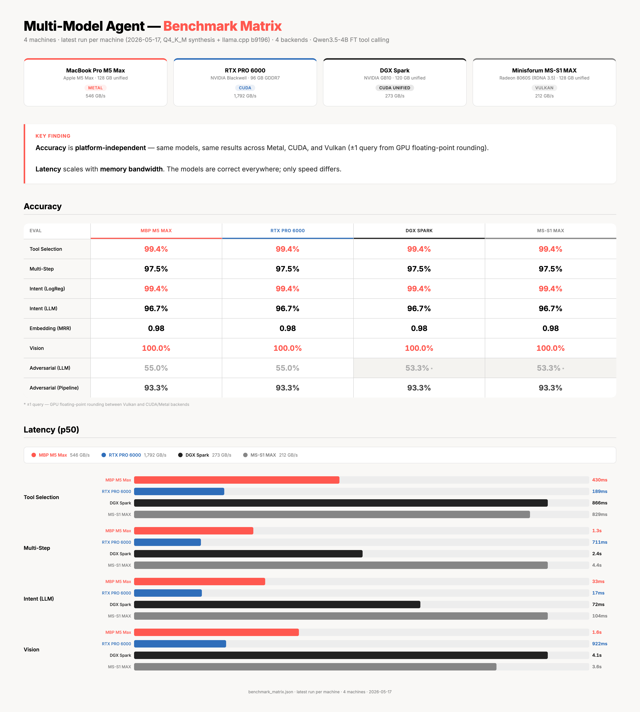

# Multi-Model Local AI Agent with Small Language Models

> ⚠️ **Conference talk demo — not production code.**
> This repository accompanies a conference keynote on local on-device AI.
> It is published as a **reference for the architectural patterns shown on
> stage** — small-model task specialisation, local fine-tuning, deterministic
> scaffolding, hybrid cloud escalation — **not** as a production-ready system.
>
> Read the code as illustration, not prescription. No security audit, no SLA,
> pinned to the talk's state. See [`SECURITY.md`](SECURITY.md) for the explicit
> threat model and what's intentionally out of scope.

---

> **Multiple small, specialized local models outperform a single giant cloud model
> on domain tasks — while keeping every byte of data private.**

A demo AI agent built entirely on local small language models served via
[llama.cpp](https://github.com/ggml-org/llama.cpp) (`llama-server`).
Built for conference showcases of the **Local AI story**: no cloud, no rate limits, no data leaving your network.
Uses Google Gemma family models for synthesis and retrieval, and a fine-tuned Qwen3.5-4B for tool calling.

---

## Architecture

```
User Query
    │
    ├── has image(s)? ──YES──→ image query → gemma3-4B (vision) → response
    │ NO
    └── text only
         │
         ▼
    ┌─────────────────────────────────────────────────────────────────┐
    │  SmallLanguageModelAgentOrchestrator                            │
    │                                                                 │
    │  1. Intent Classification                                       │
    │     Primary:  LogReg on embeddinggemma vectors (~10ms,          │
    │               deterministic, ~93% of traffic)                   │
    │     Fallback: gemma3-ft generative (only when LogReg            │
    │               model.joblib is absent at startup)                │
    │     → rag_query | tool_use | direct_answer                      │
    │                                                                 │
    │  2. Routing & Execution                                         │
    │     ├── RAG Query                                               │
    │     │   ├── rewrite ─ gemma3-ft (keyword phrase)                │
    │     │   ├── search ── embeddinggemma-ft (FT 300M)               │
    │     │   └── answer ── gemma3-4B (synthesis from top-k)          │
    │     ├── Tool Use (single-step)                                  │
    │     │   ├── select ── qwen35-toolcalling-ft v8 (4B, native      │
    │     │   │             function calling; ~200ms CUDA /           │
    │     │   │             ~2800ms Metal f16)                        │
    │     │   ├── execute  ── calculator (sandboxed eval)             │
    │     │   │             or sql_query (read-only SELECT)           │
    │     │   └── format ── gemma3-ft                                 │
    │     ├── Tool Use (multi-step)                                   │
    │     │   ├── detect ── 11 regex patterns                         │
    │     │   ├── decompose ── gemma3-ft (JSON plan + fallback)       │
    │     │   ├── step 1 ── qwen35-ft (sql_query selection + args)    │
    │     │   ├── step 2 ── qwen35-ft (calculator selection + args,   │
    │     │   │             prior result in context)                  │
    │     │   └── synth ── qwen35-ft (combined answer; routed off     │
    │     │                gemma3-1B in commit 118b6a1)               │
    │     └── Direct Answer ── gemma3-ft                              │
    │                                                                 │
    └─────────────────────────────────────────────────────────────────┘
         │
         ▼
    Natural-language response + per-step timing
```

> **About the deterministic pre-routers.** Earlier iterations of the agent
> shipped two pattern-matching pre-routers (`expression_builder.py` /
> `sql_builder.py`) that intercepted queries before the tool-calling
> model. They were retired in commit
> [`68d52a5`](https://github.com/thinktecture-labs/local-multi-model-agent-slm/commit/68d52a5)
> once Qwen3.5-4B FT v8 took over native tool selection (~99.4% routing
> accuracy). The orchestrator still passes
> `ExpressionResolver` / `SQLResolver` protocols for DI extensibility, but
> production uses the `Null*Resolver` no-op implementations.

### The Model Stack

Each model runs as an independent `llama-server` instance (OpenAI-compatible API).
Model names and ports are configured via `.env`.

| Role | Base Model (HuggingFace) | Fine-tuned Name | Port | Task |
|------|--------------------------|-----------------|------|------|
| **Router** | LogReg on FT-embeddinggemma vectors | `intent-logreg` (sklearn .joblib) | (in-process) | **Primary** intent classifier (~10ms, deterministic, handles ~93% of traffic) |
| **Thinker** | `google/gemma-3-1b-it` (1B params) | `gemma3-ft` | 9090 / 9094 | Direct answers, query decomposition, tool-result synthesis, intent-classification fallback when LogReg is absent |
| **Doer** | `Qwen/Qwen3.5-4B` (4B params) | `qwen3.5-4b-toolcalling-ft` (v9) | 9091 / 9095 | Tool calling: calculator or sql_query (99.4% single-step routing, 97.5% multi-step chain — v9 matches v8's chain-shape number AND adds 100% SQL valid execution; v8 chain-shape was inflated by training on broken SQL the eval didn't catch. Fully deterministic — see [`docs/benchmarks/FINE_TUNING_INSIGHTS.md`](docs/benchmarks/FINE_TUNING_INSIGHTS.md#3b-qwen35-4b-ft-v8--current-production-2026-03-19) §3b.) |
| **Librarian** | `google/embeddinggemma-300m` (308M params) | `embeddinggemma-ft` | 9092 / 9096 | Semantic document embedding & retrieval |
| **Eye** | `google/gemma-3-4b-it` (4B params) | `gemma3-4b-ft` (FT for RAG synthesis; mmproj projector is base) | 9093 | Image understanding (via mmproj projector) + RAG synthesis from retrieved context |
| **Reader** | `zai-org/GLM-OCR` (0.9B params) | — (base only) | 9098 | PDF text + table extraction via OCR (upload-time only, optional) |

Base GGUFs are downloaded by `setup.sh` from `ggml-org` (official quantizations). Fine-tuned GGUFs are produced by the training + conversion pipeline. The OCR model is base-only (not fine-tuned); the vision/synthesis 4B model has an FT GGUF (`gemma3-4b-ft-merged/`) for RAG synthesis on the text side, while its `mmproj` image projector remains the base file.

> **Why does the 4B model handle RAG synthesis?** The 1B model cross-contaminated facts across multiple source documents — it would blend details from unrelated docs into a single answer. The 4B model's larger context window and superior multi-document comprehension produces accurate, source-faithful answers (96% accuracy on 25-query RAG eval). **Single-step** tool-result formatting (single values, tables — `tool_format_prompt`) still uses gemma3-1B; **multi-step** synthesis was routed to Qwen3.5-4B FT in commit `118b6a1` after gemma3-1B was found to plagiarise fewshot example numbers.

### Built-in Tools

| Tool | Description |
|------|-------------|
| `sql_query` | Read-only SELECT queries against SQLite (executor: `src/engine/tools/sql_query.py`) |
| `calculator` | Sandboxed math expression evaluator via `simpleeval` |

Tool selection + argument generation is handled by **Qwen3.5-4B FT v9** via native OpenAI-compatible function calling (~195ms CUDA / ~430ms Metal Q4_K_M, with llama.cpp b9196). 99.4% single-step routing accuracy, 97.5% multi-step chain shape, 100% SQL execution validity on Nextera (v9 post-2026-05-15 retrain). System is fully deterministic — `client.call_function(deterministic=True)` plumbed end-to-end with `temperature=0, seed=42, top_k=1, top_p=1`.

Semantic search (vector retrieval via embeddinggemma + ChromaDB) is handled directly by the orchestrator for `rag_query` intents — it is not a Qwen tool.

---

## Performance — four machines, one stack

Same code, same FT models, byte-deterministic, four hardware backends (Apple Metal, NVIDIA Blackwell CUDA, NVIDIA GB10 CUDA-unified, AMD RDNA 3.5 Vulkan), **Q4_K_M synthesis production + llama.cpp b9196**. Accuracy is identical across all four; only latency differs.



| | bench.py median | bench.py mean |
|---|---|---|
| RTX PRO 6000 (Blackwell CUDA) | **329 ms** | **437 ms** |
| MBP M5 Max (Metal) | 688 ms | 791 ms |
| Strix Halo (RDNA 3.5 Vulkan) | 1455 ms | 1630 ms |
| DGX Spark (GB10 CUDA) | 1657 ms | 2018 ms |

Per-path latency tables, per-step breakdown, and the full eval matrix are in [`docs/benchmarks/FINE_TUNING_INSIGHTS.md`](docs/benchmarks/FINE_TUNING_INSIGHTS.md). The interactive HTML chart (TT brand colours) lives at [`docs/benchmarks/benchmark_visualization.html`](docs/benchmarks/benchmark_visualization.html) — open it locally for a colourised view of the matrix.

---

## Quick Start

### Prerequisites

- Python 3.10+
- Node.js 22+ (for Observatory UI build — `.nvmrc` included, auto-detected from system or nvm)
- cmake (for building llama-server)
- NVIDIA GPU with CUDA **or** Apple Silicon (Metal) **or** CPU-only (`--cpu` flag)
- Optional: `ffmpeg` for voice mode (`brew install ffmpeg` / `apt install ffmpeg`)
- Optional: [mactop](https://github.com/context-labs/mactop) for real-time GPU metrics on Metal (`brew install mactop`)
- ~5.5 GB disk for base GGUFs + llama.cpp build (+ ~22 GB for optional Qwen comparison model)

### One-Command Setup

```bash
git clone --recurse-submodules https://github.com/thinktecture-labs/local-multi-model-agent-slm
cd local-multi-model-agent-slm
bash setup.sh                    # core setup (Gemma models + UI + data)
bash setup.sh --include-voice    # + whisper.cpp STT + Piper TTS
bash setup.sh --include-qwen     # + Qwen 3.5 comparison model (~22 GB)
bash setup.sh --all              # everything
```

`setup.sh` will:

1. Build `llama-server` from the vendored `vendor/llama.cpp` submodule (CUDA/Metal/CPU auto-detected)
2. Download all four Gemma GGUFs from HuggingFace (`ggml-org` official builds), including gemma3-4B + mmproj for vision
3. Create a Python virtualenv and install dependencies
4. Build the Observatory React UI (`npm install` + `npm run build`)
5. Seed demo data (SQLite + ChromaDB — starts model servers temporarily for embedding)
6. *(Optional)* Build whisper.cpp and download Piper TTS voices for voice mode
7. *(Optional)* Download Qwen 3.5 35B-A3B GGUF for three-path comparison demo

### Start Everything (Servers + Web App)

```bash
# One command: llama-servers + API + Observatory UI
bash scripts/start_app.sh                        # fine-tuned models (default)
bash scripts/start_app.sh --base                 # base models (pre fine-tuning)
bash scripts/start_app.sh --scenario foo         # use scenarios/foo.json
bash scripts/start_app.sh --port 3000            # custom API port

# Ctrl-C stops everything (llama-servers + uvicorn)
# For a robust stop after a crashed / detached session, use:
bash scripts/stop_app.sh                         # kills via PID files + pkill + port sweep
```

### Start Model Servers Only

```bash
# Fine-tuned models (default)
bash scripts/start_servers.sh --bg

# Base models only (pre fine-tuning)
bash scripts/start_servers.sh --bg --base

# CHEAT MODE: base (9090-9093) + fine-tuned (9094-9096) on separate ports
# Both sets available immediately for instant BASE↔FT swap (~100ms)
bash scripts/start_servers.sh --all --bg

# FT servers only on secondary ports (9094-9096) — used after training
bash scripts/start_servers.sh --ft-extra --bg

# CPU-only (no Metal/CUDA — runs entirely on system RAM)
bash scripts/start_servers.sh --bg --cpu
bash scripts/start_servers.sh --bg --base --cpu

# Scenario selection (default: nextera)
bash scripts/start_servers.sh --bg --scenario foo

# Stop all servers
kill $(cat .server-pids) && rm .server-pids
```

### Run the Demo

```bash
source .venv/bin/activate
python demo.py                          # showcase mode (9 text + 3 image queries)
python demo.py --interactive            # REPL for live demos
python demo.py --query "What is the Enterprise plan?"
python demo.py -q "What trends do you see?" --image data/demo-images/revenue_chart.png
```

### Configuration

All ports and model names live in `.env` (created from `.env.example` by `setup.sh`). Override without touching `.env` by creating `.env.local`:

```bash
# .env.local — local overrides (gitignored)
INFERENCE_PORT=9090
INFERENCE_MODEL=gemma3-ft
```

#### The `.env*` files

The repo ships four `.env`-flavoured files; only the first is your private one.

| File | In git? | What it does |
| --- | --- | --- |
| `.env` | **gitignored** | Your local config — paths, ports, and any secrets (e.g. `OPENAI_API_KEY`). Created by `setup.sh` from `.env.example`. |
| `.env.example` | tracked | The canonical template. Edit your own copy at `.env` or `.env.local`. |
| `.env.qwen` | tracked | **Opt-in alternative stack.** Swaps every llama-server to Qwen 3.5-4B (text + tool calling + vision). Activate with `cp .env.qwen .env.local` and re-run `start_servers.sh`. |
| `.env.qwen-compare` | tracked | **A/B comparison server.** Adds a Qwen-35B-A3B server on port 9100 alongside the main stack. Sourced automatically when you pass `--qwen` to `start_servers.sh`. |

`.env.local` is also gitignored — use it for one-off overrides that should not land in your `.env`.

---

## Demo Scenarios, Use Cases & Data

The demo is built around **Nextera Platform** — a fictional enterprise AI SaaS company.

### Seeded data

| Store | Contents | Used for |
| --- | --- | --- |
| **ChromaDB** (vector) | 13 knowledge-base documents covering plans, pricing, features, compliance, deployment | RAG queries — natural language product questions |
| **SQLite** (`business.db`) | 3 tables: `products` (3 tiers), `customers`, `sales` (2023–2024) | SQL queries — structured data and aggregations |

### Intent paths (4-way routing)

| Intent | What the agent does |
| --- | --- |
| **image_query** | Deterministic: if image(s) present → gemma3-4B (vision) analyses and responds |
| **rag_query** | Rewrites query -> embeds with embeddinggemma -> searches ChromaDB -> synthesises with gemma3-4B (vision model, superior multi-doc comprehension) |
| **tool_use** (single) | Qwen3.5-4B FT v9 selects the tool and emits arguments via native function calling (~250ms CUDA / ~1100ms Metal Q4_K_M) → tool executes → gemma3-ft formats the result for the user. 99.4% routing accuracy. |
| **tool_use** (multi-step) | 11 regex patterns detect compound queries → gemma3-ft decomposes into step descriptions (JSON, with mechanical fallback) → step 1: Qwen3.5-4B FT v9 selects `sql_query` + args → step 2: Qwen3.5-4B FT v9 concretises remaining variables and emits the calculator call → Qwen3.5-4B FT v9 also handles the multi-step synthesis. 97.5% chain accuracy on Nextera (v9, deterministic). See [`docs/benchmarks/FINE_TUNING_INSIGHTS.md`](docs/benchmarks/FINE_TUNING_INSIGHTS.md#3b-qwen35-4b-ft-v8--current-production-2026-03-19) §3b for the architectural rationale (`concretize_step` and multi-step synthesis route through Qwen FT — gemma3-1B was unreliable on structured-context reasoning). |
| **direct_answer** | gemma3-ft answers without any tool -- greetings, capability questions |

---

## Running the Demo

### Showcase Mode

```bash
python demo.py
```

### Interactive REPL

```bash
python demo.py --interactive
# Type 'showcase' to run all preset queries
# Type 'exit' to quit
```

### Single Query

```bash
python demo.py --query "What is the difference between Professional and Enterprise plans?"
```

---

## REST API Server

```bash
uvicorn src.server:app --host 0.0.0.0 --port 8000 --reload
```

Interactive API docs: [http://localhost:8000/docs](http://localhost:8000/docs)

Observatory UI: [http://localhost:8000/app](http://localhost:8000/app) (React 19 + Vite + TypeScript, configurable API base via `VITE_API_BASE` env var) — visual agent dashboard with:
- **Live Document Drop**: drag-drop PDF/TXT/MD files for instant RAG indexing via embeddinggemma + ChromaDB, with real-time SSE progress (parsing -> chunking -> embedding -> indexed)
- **Kill the WiFi**: airplane mode toggle blocks all cloud calls, proving 100% local operation. Compare and escalate endpoints disabled when offline.
- **Hybrid Routing (HITL)**: confidence-based routing with human-in-the-loop cloud escalation. 8-factor heuristic scores local response confidence; when below threshold, an inline escalation banner appears with confidence score and "Escalate to Cloud" button — data only leaves the machine with explicit user approval. After escalation, a cloud badge (model name) and latency time appear in the exchange header.
- **Cost counter**: running `Local: $0.00 | Cloud (est.): $X.XX` comparison (GPT-5.4 pricing). Shows "Cloud (est.)" for estimated savings in local-only mode; switches to "Cloud:" when actual cloud calls are made.
- **Privacy badge**: live proof of zero external data transfer, highlights green in offline mode
- **Zero-downtime model swap**: dual-port architecture — base servers (9090-9093) and fine-tuned servers (9094-9096) run simultaneously, toggle switches which ports the agent talks to (~100ms, no restart)
- **Eval A/B dashboard**: one-click model evaluation with Before/After comparison (5.6% base vs 96.7% fine-tuned on 180 unseen queries — gemma3-ft fallback path post-2026-05-15 retrain)
- **Latency waterfall**: per-step timing visualization on a shared time axis
- **GPU dashboard**: real-time VRAM, utilization, temperature, power (CUDA via nvidia-smi, Metal via [mactop](https://github.com/context-labs/mactop))
- **Data flywheel**: Use → Log → Train → Deploy flow visualization with interaction counter
- **Cloud comparison**: side-by-side local vs cloud LLM (optional, needs `OPENAI_API_KEY`)
- **Collapsible trace pane**: starts collapsed, auto-expands on query
- **Error boundary**: React error boundary wraps the entire app, preventing full UI crashes on malformed API responses
- **Request ID tracing**: each agent response includes a unique `request_id` (12-char hex UUID) for end-to-end observability
- **Voice input + wake word**: push-to-talk mic with STT → agent → TTS, plus OpenWakeWord browser-side wake word detection ("Hey Jarvis" keyword via in-browser ONNX inference, auto-starts recording)
- **Show Mode** (Cmd+Shift+P): cinematic full-screen keynote demo — animated canvas orb (audio-reactive waveform), 5-model activity strip, smart cards (KPI counter, bar chart, ranked bars, table) auto-detected from SQL results, dark/light theme toggle, collapsible sample query chips

### Endpoints

| Method | Path | Description |
|--------|------|-------------|
| `POST` | `/query` | Process a query through the agent pipeline. Accepts optional `backend` parameter: `multi-models` (default), `qwen`, or `cloud` |
| `POST` | `/query/compare-all` | Run all available backends (multi-models, qwen, cloud) in parallel and return a `ThreePathResponse` |
| `POST` | `/upload-document` | Upload & index a PDF/TXT/MD file with SSE progress |
| `POST` | `/escalate` | HITL cloud escalation (user-approved, only path that sends data externally) |
| `POST` | `/network-mode` | Toggle online/offline (Kill the WiFi) |
| `POST` | `/routing-mode` | Toggle local-only/hybrid routing |
| `GET` | `/health` | Check model server availability, chunk count, interaction count |
| `GET` | `/tools` | List registered tools and their schemas |
| `POST` | `/documents` | Add a document to the knowledge base |
| `POST` | `/export-training-data` | Export interaction logs for fine-tuning |
| `POST` | `/eval` | Run intent classification evaluation (60-query test set) |
| `GET` | `/eval/results` | Stored before/after eval snapshots |
| `POST` | `/eval/reset` | Clear stored eval results |
| `GET` | `/gpu` | Real-time GPU statistics (CUDA / Metal / CPU) |
| `GET` | `/privacy` | Zero-exfiltration proof (queries, tokens, bytes, network mode, routing mode) |
| `POST` | `/models/swap` | Zero-downtime dual-port model swap (~100ms) |
| `GET` | `/models/mode` | Current model mode (base or finetuned) |
| `POST` | `/compare` | Side-by-side local vs cloud LLM comparison (blocked when offline, uses GPT-5.4) |

**Vision queries**: Send images as base64 strings in the JSON body: `{ "query": "Describe this chart", "images": ["base64..."] }`. This keeps the API simple for demo-sized images. For production with large files, consider multipart uploads.

**Cloud comparison**: Set `OPENAI_API_KEY` in `.env` to enable real cloud queries via `/compare` and the three-path comparison mode (`/query/compare-all`). Without it, only estimated cloud cost is shown (based on GPT-5.4 pricing: $2.50/1M input, $15.00/1M output tokens).

### Remote Access

The Observatory is a local FastAPI app on `http://localhost:8000`. For remote use
(viewing the demo from a different machine), the simplest approach is an SSH tunnel:

```bash
ssh -N -L 8000:localhost:8000 <your-gpu-host>
# then open http://localhost:8000/app in the local browser
```

Server-Sent Events (the `/query/stream` endpoint) are compression-exempt so streaming
tokens flow without buffering — relevant if you put a reverse proxy in front.

---

## Project Structure

```
local-multi-model-agent-slm/
├── demo.py                    ← Rich console demo (conference showcase)
├── setup.sh                   ← One-command bootstrap
├── .env.example               ← Configuration template (setup.sh copies to .env)
├── requirements.txt           ← Runtime + test dependencies
├── requirements-finetune.txt  ← Fine-tuning dependencies
│
├── docs/
│   ├── architecture/             ← C4 diagrams (PlantUML + Mermaid), GLOSSARY, scenario decoupling plan, GLM-OCR + structured-extraction design, streaming plan
│   ├── benchmarks/               ← ADVERSARIAL_EVAL, EVAL_RESULTS_2026-04-05, FINE_TUNING_INSIGHTS (the deep fine-tuning analysis)
│   ├── c4/                       ← .puml source for the C4 diagrams
│   ├── guides/                   ← BUSINESS_SCENARIO (Nextera + demo data), DEMO_SCRIPT (on-stage walkthrough), SCENARIO_PLAYBOOK (adding a new scenario)
│   └── research/                 ← Aspirational explorations (Gemma 4, inference optimization, PII redaction, wake-word)
│
├── scripts/
│   ├── start_app.sh           ← Start servers + API + Observatory UI (one command)
│   ├── start_servers.sh       ← Start all four llama-server instances
│   ├── build_llama.sh         ← Build llama-server from vendored submodule
│   ├── benchmark.py           ← Latency / throughput benchmarking
│   ├── generate_sample_images.py ← Generate sample images for vision demo
│   └── generate_multi_turn_data.py ← Generate multi-turn training data for qwen3.5-4b
│
├── vendor/
│   └── llama.cpp/             ← Git submodule (pinned commit, CUDA/Metal/CPU)
│
├── models/                       ← (all gitignored; populated by setup.sh + training pipeline)
│   ├── gemma3/                       ← Base 1B GGUF (downloaded by setup.sh)
│   ├── gemma3-4b/                    ← Base 4B vision GGUF + mmproj (downloaded by setup.sh)
│   ├── qwen3.5-4b/                   ← Base Qwen 4B GGUF (downloaded by setup.sh)
│   ├── embeddinggemma/               ← Base embeddinggemma GGUF (downloaded by setup.sh)
│   ├── glm-ocr/                      ← Base GLM-OCR GGUF + mmproj (downloaded by setup_ocr.sh)
│   ├── gemma3-1b-ft-merged/          ← Fine-tuned 1B (produced by train_gemma3.py)
│   ├── gemma3-4b-ft-merged/          ← Fine-tuned 4B (produced by train_gemma3_4b.py)
│   ├── qwen3.5-4b-toolcalling-ft-merged/  ← Fine-tuned Qwen tool caller v9 (PRODUCTION, post-2026-05-15 retrain)
│   ├── embeddinggemma-300m-ft-merged/ ← Fine-tuned embedder
│   └── intent-logreg/                ← LogReg primary intent classifier (sklearn .joblib + meta.json)
│
├── src/                          ← All source code (production runtime)
│   ├── engine/                   ← Core agent runtime
│   │   ├── agent/                  ← Orchestration + reasoning
│   │   │   ├── orchestrator.py       ← SmallLanguageModelAgentOrchestrator (~245 lines, thin router)
│   │   │   ├── handlers/             ← Extracted handler classes
│   │   │   │   ├── direct_answer.py    ← DirectAnswerHandler
│   │   │   │   ├── rag.py             ← RAGHandler (rewrite → search → 4B synthesis)
│   │   │   │   ├── tool_use.py        ← ToolUseHandler (single-step + multi-step)
│   │   │   │   ├── vision.py          ← VisionHandler (image analysis via 4B)
│   │   │   │   └── protocol.py        ← Handler protocol interface
│   │   │   ├── types.py              ← Intent, ExecutionStep, AgentResponse + request_id, CLASSIFY_PROMPT
│   │   │   ├── intent_classifier.py  ← IntentClassifier
│   │   │   ├── query_decomposer.py   ← QueryDecomposer for multi-step reasoning
│   │   │   ├── cloud_orchestrator.py    ← CloudOrchestrator: GPT-5.4 with local RAG + tool calling
│   │   │   ├── tool_argument_resolver.py ← Protocol-based DI for tool args
│   │   │   └── interaction_logger.py ← JSONL logging for fine-tuning export
│   │   ├── inference/              ← LLM communication
│   │   │   ├── client.py            ← SmallLanguageModelClient: unified async client for all 4 models
│   │   │   └── config.py            ← Centralized configuration (timeouts, temperatures, concurrency limits)
│   │   ├── scaffolding/            ← Deterministic compensators for SLM limits
│   │   │   └── confidence_router.py  ← 8-factor confidence scoring for hybrid-routing escalation
│   │   ├── knowledge/              ← RAG pipeline + OCR
│   │   │   ├── vector_store.py      ← ChromaDB wrapper (async, external embeddings)
│   │   │   ├── document_processor.py ← PDF/TXT/MD parsing, smart OCR, table chunking, SSE indexing
│   │   │   └── ocr_client.py        ← GLM-OCR async client (upload-time PDF extraction)
│   │   └── tools/                  ← Pluggable tool framework
│   │       ├── base_tool.py, tool_registry.py, tool_result.py
│   │       ├── vector_search.py, calculator.py, sql_query.py
│   │
│   ├── server/                   ← FastAPI HTTP layer (8 modules)
│   │   ├── __init__.py             ← App wiring, lifespan, CORS
│   │   ├── state.py, models.py     ← Shared state + Pydantic models
│   │   ├── agent_routes.py         ← /query, /health, /tools, /documents
│   │   ├── training_routes.py      ← /train, /eval SSE endpoints
│   │   ├── voice_routes.py         ← /voice/chat, /voice/audio, /voice/synthesize
│   │   ├── cloud_routes.py         ← /compare, /escalate
│   │   └── system_routes.py        ← /gpu, /privacy, /network-mode, /models/swap
│   │
│   └── clients/                  ← Consumer-facing applications
│       ├── observatory-react/      ← Observatory React 19 + Vite + TypeScript (served at /app)
│       ├── ios/                    ← On-device iOS agent (LFM 2.5 via LEAP SDK)
│       └── webgpu/                 ← Browser inference (LFM 2.5 via Transformers.js + WebGPU)
│
├── data/
│   ├── loader.py              ← Seed data for demo (13 docs + SQLite)
│   ├── business.db            ← SQLite: products, customers, sales (auto-created, gitignored)
│   ├── business-documents/    ← 13 knowledge-base documents (RAG corpus)
│   ├── demo-documents/        ← Meridian Health ADR (PDF, MD, PNG) + demo queries
│   ├── training-data/         ← Generated JSONL datasets for fine-tuning
│   └── demo-images/           ← Sample images for vision demo
│
├── finetune/
│   ├── data_prep.py                      ← Convert interaction logs → training datasets
│   ├── data_prep_gemma3.py               ← Intent + synthesis dataset for Gemma3-1B
│   ├── data_prep_qwen35_toolcalling.py   ← Tool-calling dataset for Qwen3.5-4B (1,372 examples)
│   ├── data_prep_embeddinggemma.py       ← Retrieval dataset from interaction logs
│   ├── data_prep_shared.py               ← Shared data-prep utilities
│   ├── gen_embeddinggemma_dataset.py     ← Generate 507 retrieval pairs + hard negatives from KB docs
│   ├── gen_gemma3_synthesis_dataset.py   ← Generate 201 synthesis examples (RAG + tool format + multi-step + direct)
│   ├── pipeline.py                       ← SmallLanguageModelFineTuningPipeline + CLI
│   ├── train_gemma3.py                   ← LoRA fine-tune Gemma3-1B (intent + synthesis)
│   ├── train_gemma3_4b.py                ← LoRA fine-tune Gemma3-4B (RAG synthesis + vision)
│   ├── train_qwen35_toolcalling.py       ← QLoRA fine-tune Qwen3.5-4B (tool calling, PRODUCTION)
│   ├── train_embeddinggemma.py           ← Contrastive fine-tune embeddinggemma (MNRL)
│   ├── eval_base.py                      ← Shared evaluation utilities (Wilson CI, latency stats)
│   ├── eval_gemma3.py                    ← Intent classification benchmark (fallback path)
│   ├── eval_intent_logreg.py             ← Intent classification benchmark (primary LogReg path)
│   ├── eval_tool_routing.py              ← Tool selection benchmark (Qwen FT v8, 160 queries)
│   ├── eval_multi_step.py                ← Multi-step tool-chain benchmark (80 queries)
│   ├── eval_rag_groundtruth.py           ← RAG end-to-end accuracy (80 queries)
│   ├── eval_response_quality.py          ← Synthesis quality (response-vs-expected scoring)
│   ├── eval_embeddinggemma.py            ← Retrieval quality benchmark (MRR@10, Recall@5)
│   ├── eval_extraction.py                ← Structured-extraction field accuracy
│   ├── eval_expression_pipeline.py       ← End-to-end calculator pipeline (80 queries)
│   ├── eval_vision.py                    ← Vision accuracy benchmark (10 image+question pairs)
│   ├── eval_adversarial.py               ← Adversarial / OOD robustness baseline (60 queries)
│   ├── eval_ocr.py                       ← OCR extraction quality
│   ├── collect_results.py                ← Aggregate results JSONs into the cross-machine matrix
│   ├── convert_gemma3_to_gguf.sh         ← Convert Gemma3-1B-FT merged HF → GGUF
│   ├── convert_gemma3_4b_to_gguf.sh      ← Convert Gemma3-4B-FT merged HF → GGUF
│   ├── convert_qwen35_to_gguf.sh         ← Convert Qwen3.5-4B-FT merged HF → GGUF
│   ├── convert_embeddinggemma_to_gguf.sh ← Convert EmbeddingGemma-FT merged HF → GGUF (q8_0)
│   ├── upload_ft_to_hf.sh                ← Publish FT GGUFs to HuggingFace (thinktecture org)
│   ├── MODEL_CARDS.md                    ← One section per published FT model
│   ├── MODEL_LICENSES.md                 ← Licence-inheritance notes (Gemma Terms, Tongyi Qianwen)
│   └── README.md                         ← Per-script reference
│
├── training/                     ← LogReg trainer (sklearn — separate from the LoRA-based finetune/ pipeline)
│   └── train_intent_logreg.py        ← Fit LogReg on FT EmbeddingGemma vectors (primary intent path)
│
├── scripts/                      ← Shell + Python tooling (start_servers, setup, build_llama, benchmarks, generators)
├── tests/
│   ├── conftest.py            ← Shared fixtures (mocks, temp DB, server-health gates)
│   ├── unit/                  ← No external services required
│   ├── integration/           ← Local SQLite only
│   └── e2e/                   ← All four llama-server instances required
```

---

## Fine-Tuning the Text Models

After running the demo, interactions are logged automatically. Use them to improve the three text models (the vision model runs base-only).

### Quick Start — Gemma3-1B FT only (for the demo arc)

```bash
pip install -r requirements-finetune.txt

# Baseline → train → convert → eval
python -m finetune.eval_gemma3 --save results/baseline_gemma3.json
python -m finetune.train_gemma3 --task intent --epochs 7 --lr 5e-5
bash finetune/convert_gemma3_to_gguf.sh
bash scripts/start_servers.sh --bg --ft
python -m finetune.eval_gemma3 --save results/finetuned_gemma3.json
python -m finetune.eval_gemma3 --compare results/baseline_gemma3.json results/finetuned_gemma3.json
```

### Full Pipeline — All Text Models

```bash
# 0. Prepare all training datasets
python -m finetune.data_prep

# 1. Run baselines for all text models (base servers must be running)
bash scripts/start_servers.sh --bg
python -m finetune.eval_gemma3              --save results/baseline_gemma3.json
python -m finetune.eval_tool_routing   --save results/baseline_tool_routing.json
python -m finetune.eval_embeddinggemma --save results/baseline_embeddinggemma.json

# 2. Fine-tune all text models
python -m finetune.train_gemma3 --task both --epochs 7 --lr 5e-5     # gemma3 1B: LoRA, intent + synthesis (post-2026-05-15 retrain)
python -m finetune.train_qwen35_toolcalling                          # Qwen3.5-4B FT v9 (QLoRA, production tool caller)
python -m finetune.train_embeddinggemma   # embeddinggemma: semantic retrieval (10 epochs)

# 3. Convert all to GGUF
bash finetune/convert_gemma3_to_gguf.sh              # gemma3 → models/gemma3-1b-ft-merged/
bash finetune/convert_qwen35_to_gguf.sh # qwen3.5-4b → models/qwen3.5-4b-toolcalling-ft-merged/
bash finetune/convert_embeddinggemma_to_gguf.sh # embeddinggemma → models/embeddinggemma-300m-ft-merged/

# 4. Restart with all fine-tuned models (--ft uses FT GGUFs where available)
bash scripts/start_servers.sh --bg --ft

# 5. Rebuild vector index with fine-tuned embedding model
python -m data.loader

# 6. Post-training evals and comparisons
python -m finetune.eval_gemma3              --save results/finetuned_gemma3.json
python -m finetune.eval_tool_routing   --save results/finetuned_tool_routing.json
python -m finetune.eval_embeddinggemma --save results/finetuned_embeddinggemma.json

python -m finetune.eval_gemma3 --compare \
    results/baseline_gemma3.json results/finetuned_gemma3.json
python -m finetune.eval_tool_routing --compare \
    results/baseline_tool_routing.json results/finetuned_tool_routing.json
python -m finetune.eval_embeddinggemma --compare \
    results/baseline_embeddinggemma.json results/finetuned_embeddinggemma.json

# 7. Adversarial / OOD robustness eval (60 queries, 6 attack categories)
python -m finetune.eval_adversarial --save results/adversarial_ft.json
```

### Per-Model Details

| Model | Script | Method | What improves |
|-------|--------|--------|---------------|
| **gemma3-1B FT** | `train_gemma3.py` | EVA + rsLoRA r=8 on 1B-it, cosine LR, 7 epochs | Direct answers + tool-result synthesis (1,878 + 201 examples) + intent-classification fallback |
| **gemma3-4B FT** | `train_gemma3_4b.py` | LoRA r=16, 3 epochs, lr=5e-5 | RAG synthesis from retrieved context; vision channel left base-only |
| **qwen3.5-4b-toolcalling-ft** | `train_qwen35_toolcalling.py` | QLoRA r=16 (Unsloth), lr=2e-4, 2 epochs | Tool selection + argument generation (1,372 examples) — **production tool caller** |
| **embeddinggemma FT** | `train_embeddinggemma.py` | Contrastive (MNRL), up to 10 epochs with save_best | Retrieval MRR@10, Recall@5 |
| **LogReg intent classifier** | `training/train_intent_logreg.py` | scikit-learn LogReg on FT-embeddinggemma 768-dim vectors | **Primary** intent path — replaces the generative 1B classifier (~10ms, deterministic) |

### Typical Results

| Model | Metric | Baseline | After Fine-Tuning |
|-------|--------|----------|-------------------|
| LogReg classifier (primary intent) | Intent accuracy (3-way, 180 unseen queries) | — | **99.4%** (was 97.2% pre-2026-05-15 retrain) |
| gemma3-1B FT (fallback intent path) | Intent accuracy (3-way, 180 unseen queries) | 0% (base 1B-it) | **96.7%** (was 93.3% pre-retrain) |
| gemma3-1B FT | `rag_query` | 0% | 98% |
| gemma3-1B FT | `tool_use` | 0% | 100% |
| gemma3-1B FT | `direct_answer` | 0% | 92% |
| Qwen3.5-4B FT v9 | Tool routing (160 queries) | ~60% (zero-shot) | **99.4%** |
| Qwen3.5-4B FT v9 | Multi-step tool chain (80 queries) | ~55% (base) | **97.5%** (78/80) — matches v8's chain-shape number AND adds 100% SQL valid execution (v8 era number was inflated by training on broken SQL the eval didn't catch). Deterministic. |
| embeddinggemma FT | MRR@10 on 26-passage eval set | 95.3% | **98.0%** (+2.67pp). **Caveat:** measured on 26 passages; production KB indexes ~120 chunks — uplift at scale not measured separately. |
| **End-to-end** | RAG ground-truth (80 queries) | ~65% (pre-rebalance) | **78.8%** (intent rebalancing + 4B FT + label cleanup) |

### Adversarial / OOD Robustness

The fine-tuned 1B intent classifier was evaluated against 60 adversarial and out-of-distribution queries across 6 categories. "Robustness" = fraction correctly classified as `direct_answer` (avoiding misrouting to tools/RAG).

| Category | Generative | Pipeline | Risk |
|----------|------------|----------|------|
| `off_topic` | 30% (3/10) | 100% (10/10) | General knowledge questions treated as tool-worthy |
| `injection` | 30% (3/10) | 100% (10/10) | Prompt injection trivially bypasses classification |
| `multilang` | 70% (7/10) | 70% (7/10) | Business-adjacent foreign queries partially misroute |
| `gibberish` | 60% (6/10) | 100% (10/10) | Some noise patterns trigger tool routing |
| `sql_injection` | 30% (3/10) | 100% (10/10) | Raw SQL routed to tool execution (highest risk) |
| `adversarial` | 40% (4/10) | 90% (9/10) | Label-stuffing attacks partially effective |
| **Overall** | **43.3%** (26/60) | **93.3%** (56/60) | **Pipeline: 5-layer defense stack; Generative: no negative training examples** |

**Root cause (generative):** Training data is 100% in-domain with no negative/OOD examples. The model learned "question-shaped input → tool_use" without domain boundaries. This is the classic accuracy-robustness tradeoff in small fine-tuned classifiers. **Mitigation (pipeline):** A 5-layer pre-classifier defense stack (30 regex injection patterns + gibberish detector + non-ASCII filter + LogReg confidence threshold 0.60 + canned refusal) blocks adversarial inputs before they reach the LLM — matched queries route directly to `direct_answer` without inference. This lifts robustness from 43.3% to **93.3%**. The remaining 4 failures are all multilingual queries and one crafted adversarial input. See [`docs/benchmarks/ADVERSARIAL_EVAL.md`](docs/benchmarks/ADVERSARIAL_EVAL.md) for details.

### embeddinggemma Fine-Tuning Details

`google/embeddinggemma-300m` is purpose-built for embeddings and scores 95.3% MRR@10 out of the box.
The original 37 synthetic pairs were too few for meaningful contrastive learning.

**Solution**: `finetune/gen_embeddinggemma_dataset.py` generates **507 training examples** from the 13 KB documents:

- 373 query-positive pairs (keyword, natural, conversational, comparative, scenario styles)
- 134 hard-negative triplets targeting confusable topic pairs (pricing tiers, compliance, deployment, tools, etc.)

Quality controls: Jaccard deduplication, eval leakage prevention (checked against all 25 eval queries), format validation.

**Result** (RTX PRO 6000 Blackwell, 5 epochs, 14.29s): MRR@10 improved from **0.9533 to 0.9800 (+2.67pp)** on the held-out 25-query / 26-passage eval set; Recall@5 maintained at 100%. **Caveat:** that corpus is intentionally small for fast iteration. Production retrieval against the live ChromaDB (~120 chunks across 13 KB documents) was not measured separately; the uplift at production scale may differ.

See `docs/benchmarks/FINE_TUNING_INSIGHTS.md` section 4 for the full analysis.

### gemma3 Synthesis Fine-Tuning Details

The base 1B model can classify intents but produces poorly formatted responses — missing citations, inconsistent bullet points, and weak tool-result formatting. The original synthesis dataset had only 7 examples with a mismatched instruction prompt.

**Solution**: `finetune/gen_gemma3_synthesis_dataset.py` generates **201 training examples** using the exact prompt templates from `agent.py`:

- 79 RAG synthesis (grounded answers with `[Source: ...]` citations from KB passages)
- 69 tool formatting (natural language from raw SQL/calculator JSON results)
- 23 multi-step synthesis (integrated answers combining 2 tool steps)
- 30 direct answer (greetings, capability questions, domain knowledge)

Quality controls: Jaccard deduplication on outputs, format validation, instruction pattern matching against agent.py.

FT teaches the model how to respond (format, tone, citations); RAG provides what to respond with (current facts). They're complementary.

**Production recommendation: use `--task both`** (current eval: 96.7% on the fallback intent path post-2026-05-15 retrain; LogReg primary handles 99.4% on the same 180-query set). The recommendation flipped from `--task intent` once LogReg replaced gemma3-ft as the primary classifier — gemma3-ft now serves intent fallback + query rewriting + decomposition + direct-answer + tool-result synthesis, so synthesis quality matters as much as peak classification accuracy. `--task synthesis` alone destroys classification (drops to ~17% in earlier experiments). See [`docs/benchmarks/FINE_TUNING_INSIGHTS.md`](docs/benchmarks/FINE_TUNING_INSIGHTS.md) §2 + §6 for the full experimental comparison, including the v5 era when `--task intent` was the recommended path.

### GGUF Conversion Notes

All conversion scripts use the SPM (SentencePiece) path — the same approach ggml-org uses for official Gemma3 GGUFs. Two workarounds are applied in each script:

1. **`tokenizer_config.json` from Google** — `GemmaTokenizer.save_pretrained()` omits `add_bos_token` and `added_tokens_decoder` needed by the converter
2. **`chat_template` injection** (gemma3/qwen3.5-4b) — not saved during training; needed for `/v1/chat/completions`

The embeddinggemma conversion uses `--outtype q8_0` to match the production model. Pooling type is auto-detected from the model architecture (mean pooling).

### Hardware Requirements

| Scenario | Min VRAM |
|----------|----------|
| Demo only, text (3 models) | 2 GB |
| Demo with vision (4 models) | 5 GB |
| QLoRA fine-tuning Qwen3.5-4B (LoRA r=16, Unsloth) | 8 GB |
| LoRA fine-tuning (qwen3.5-4b, full precision) | 4 GB |
| Contrastive fine-tuning (embeddinggemma) | 4 GB |

> **Qwen3.5-4B FT v9 server flags** (required for correct inference — disables thinking tokens):
>
> ```bash
> --chat-template-kwargs '{"enable_thinking":false}' --reasoning-budget 0 --top-k 20
> ```

---

## WebGPU Browser Inference

`src/clients/webgpu/` runs **LFM 2.5 1.2B Instruct** (Liquid AI) entirely in the browser via WebGPU + Transformers.js — no server, no API key, no data leaves the browser tab.

**Setup:**

```bash
cd src/clients/webgpu
npm install
python3 -m http.server 8080    # or: npm run serve
# Open Chrome at http://localhost:8080
```

Click **Download & Load Model** (~1.2 GB ONNX Q4, cached after first load). Select a sample document or drag-drop a PDF. Click **Process** — streaming analysis with entity extraction, PII detection, classification, and routing. DevTools Network tab shows zero requests during processing.

**Requirements**: Chrome 113+ with WebGPU. ~2 GB GPU memory. ~55-65 tok/s on Apple M-series.

**Demo flow**: Load model → select sample PDF → Process → watch streaming entities with PII flags → toggle browser offline → process another document → same result. See `src/clients/webgpu/README.md` for full architecture and entity type documentation.

---

## iOS On-Device Agent (LocalLife)

`src/clients/ios/LocalLife/` contains a standalone SwiftUI app that runs the same classify → route → execute → synthesize pattern on iPhone using **LFM 2.5 1.2B Instruct** via the **LEAP SDK** (Liquid AI). The model runs entirely on-device via the Neural Engine — no server, no network.

**Setup:**

```bash
# Prerequisites: Xcode 16+, iPhone 15 Pro or later (A17 Pro for Neural Engine)
# LEAP SDK: request access at https://www.liquid.ai/leap
open src/clients/ios/LocalLife/LocalLife.xcodeproj
# Build & run on device (not simulator — requires Neural Engine)
```

**Tools**: HealthKit (heart rate, blood pressure, steps, weight, sleep), Calendar (EventKit), Reminders (EventKit).

**Key architecture decisions** (documented in `src/clients/ios/LocalLife/SLM-INSIGHTS.md`):

- Fresh `Conversation` per query — history bleed degrades 1.2B tool selection
- Two-round inference: Round 1 (tool selection, `resetHistory=true`) → Round 2 (synthesis, `resetHistory=false`)
- ReWOO preflight for multi-tool queries (meeting prep) — model synthesizes only
- Keyword-based system prompt with negative disambiguation, temperature 0.0
- `bestMatch()` guard against multi-tool over-firing

**Performance**: ~5s model load, ~5-10s single query, ~15-20s meeting prep (3 tools + synthesis) on A17 Pro.

**Testing**: 8 test files — unit, integration, on-device E2E, and 5x stress tests per demo query (5/5 consistent).

---

## Voice-to-Voice (Observatory)

The Observatory UI supports click-to-record voice interaction via local **whisper.cpp** (STT) + **Piper TTS** (synthesis). Click the mic button, speak in English or German, click again to send — and hear the agent respond. All local, all private.

**Setup**:

```bash
bash setup.sh --include-voice   # or standalone: bash scripts/setup_voice.sh
# builds whisper.cpp (Metal/CUDA), downloads whisper medium model + Piper voices (~1.7 GB total)
```

**Stack**: whisper-server on port 9097 (Metal on macOS, CUDA on Linux), Piper TTS in-process (CPU/ONNX). Languages auto-detected by Whisper. Voices: `en_US-lessac-medium`, `de_DE-thorsten-high`.

**UI features**:

- Model pills for whisper STT (orange) and piper TTS (purple) in the status bar
- Pipeline trace shows "Voice -> Text" and "Text -> Speech" steps with timing
- Stop button during audio playback (replaces mic button)
- Markdown/emoji stripping before TTS for clean speech output

**Endpoints**:

- `POST /voice/chat` — full SSE streaming round-trip (transcription → agent steps → response → audio URL)
- `GET /voice/audio/{id}` — serve cached TTS audio (WAV, auto-expires after 120s)
- `POST /voice/synthesize?text=...&language=en` — standalone TTS

**CLI demo**:

```bash
bash scripts/demo_voice.sh            # quick health check + TTS test (EN + DE)
bash scripts/demo_voice.sh --full     # full voice round-trip (TTS → whisper → agent → TTS)
bash scripts/demo_voice.sh --record   # record from mic + full round-trip
```

**Latency** (RTX PRO 6000 CUDA, FT models): STT ~250ms, agent ~230-407ms (RAG with 4B synthesis), TTS ~600-1600ms. Total ~1-2.5s with progressive feedback. On M5 Max Metal (llama.cpp b8384): agent ~551-1224ms RAG, ~102-318ms SQL, ~5ms calc, total ~1.5-3s. On M3 Max Metal: agent ~635-1326ms, total ~2-4s.

**Tests**: 17 unit tests, 10 integration tests. Prerequisites: `ffmpeg` (system), `piper-tts` (pip).

---

## Document OCR (GLM-OCR)

Upload pipeline enhancement using **GLM-OCR** (0.9B, #1 on OmniDocBench) for high-quality text + table extraction from PDFs. The 5th specialized model in the stack — used at upload time only, not during queries.

**Setup:**

```bash
bash scripts/setup_ocr.sh          # downloads GLM-OCR GGUF (~1.4 GB) + pymupdf + demo docs
bash scripts/start_servers.sh --bg  # auto-starts OCR server if model present
```

**Smart hybrid extraction:** pypdf extracts text first (fast, <1s for 250 pages). Only pages where pypdf produces poor output (<100 chars or garbled) are sent to GLM-OCR. For the Snowflake 250-page annual report: only 2 of 50 pages needed OCR — upload drops from 4.4 minutes (full OCR) to 9.2 seconds (hybrid).

**Document chat mode:** After uploading a document, the Observatory UI shows a "Chatting with: filename.pdf" badge. All queries are scoped to the uploaded document via the `document_id` parameter — no intent classification needed, direct vector search + 4B synthesis. Clear the badge to return to normal agent mode.

**Architecture:** GLM-OCR runs as a llama-server on port 9098 (same binary, same API). Auto-detected at startup — no feature flags needed. Uploads go to a separate ChromaDB `uploads` collection (not the curated knowledge base). Re-uploading the same file cleanly replaces previous chunks.

**Demo:**

```bash
python demo.py --ocr                # CLI showcase: upload + query + cross-validate
bash scripts/demo_ocr.sh            # shell demo script
```

**Demo documents included:**
- `nextera_quarterly_report.pdf` — synthetic 2-page PDF matching the demo DB (cross-validate OCR vs SQL). Generate / regenerate with `python -m scripts.generate_ocr_demo_doc`.
- `snowflake-fy2025-annual-report.pdf` — real 250-page Snowflake SEC filing (public record), used as the large-doc OCR example
- `snowflake-fy2025-first50.pdf` — first 50 pages of the same, for the faster OCR demo path

**Endpoints:**

| Method | Path | Description |
|--------|------|-------------|
| `POST` | `/upload-document` | Upload & index a file with SSE progress (parsing → OCR → chunking → embedding → indexed) |
| `POST` | `/query` with `document_id` | Chat with a specific uploaded document (bypasses classifier) |
| `POST` | `/query/stream` with `document_id` | Streaming document chat via SSE |
| `DELETE` | `/uploads` | Clear all uploaded document chunks |

**Tests**: 14 unit tests (OCR client), 8 unit tests (smart OCR + table chunking), 11 integration tests (upload endpoint + document chat), 6 e2e tests (pypdf fallback + live OCR).

---

## Structured Data Extraction

Extract structured financial metrics from uploaded PDF documents and store in a SQL table for cross-source queries. Uses the same gemma3-4B model (synthesis/vision) at upload time — not a query-time tool.

**Pipeline:** Upload PDF → OCR → chunks → click "Extract structured data" → 4B model extracts JSON → stored in `competitors` table → Qwen queries JOIN `sales` + `competitors`.

**Demo flow:**
1. Upload Snowflake annual report → 209 chunks indexed
2. Click "Extract structured data" → extracts company, revenue ($3.5B), NRR (126%), 580 customers >$1M, FCF ($884M) in ~1.5s
3. Ask: "How does our revenue growth compare to Snowflake?" → Qwen JOINs both tables

**Extraction schema:** `competitors(company, fiscal_year, revenue, revenue_growth_pct, nrr, customers_1m_plus, total_customers, product_revenue, gross_margin_pct, free_cash_flow, source_document)`. Scoped to financial/SaaS metrics for the demo — see [STRUCTURED_EXTRACTION.md](docs/architecture/STRUCTURED_EXTRACTION.md) for the full developer reference.

**Endpoints:**

| Method | Path | Description |
|--------|------|-------------|
| `POST` | `/extract` | Extract structured data from an uploaded document (by document_id) |
| `GET` | `/competitors` | List all extracted competitor data |

**Eval**: 100% field accuracy (29/29 fields across 5 test cases). **Tests**: 23 unit + 4 integration.

---

## Key Design Decisions

**Why four models instead of one?**
Task decomposition beats monolithic models on domain tasks.
A 1B model fine-tuned on your domain's intent patterns outperforms a 70B generalist at that task — at a fraction of the GPU memory and latency. The 4B vision model adds multimodal capabilities and also handles RAG synthesis, where its superior multi-document comprehension produces more accurate answers than the 1B model.

**Why llama-server (llama.cpp)?**
llama-server exposes an OpenAI-compatible API directly from GGUF files — no orchestration layer needed.
The same `openai` Python client works unchanged — swap `base_url` and you're local.
Auto-detects CUDA, Metal, and CPU. Each model gets its own process and port, enabling independent scaling and GPU memory management. Vision support is built-in via the `--mmproj` flag.

**Why four separate llama-server instances?**
Each model is independent — different quantisation levels, different ports, different GPU memory budgets. Ports and model names are configured via `.env` so the on-stage demo can switch between base and fine-tuned models with one variable change. The vision model is optional — the agent degrades gracefully to text-only mode if it's not available.

**Why ChromaDB?**
Embedded, persistent, handles cosine similarity out of the box.
Embeddings are managed externally (generated by embeddinggemma) to ensure indexing and querying use the same model.

**Why async throughout?**
All llama-server API calls are I/O-bound. Full async stack means the FastAPI server handles concurrent requests without blocking. Per-model `asyncio.Semaphore` concurrency limits (default 4, configurable via `MODEL_CONCURRENCY_LIMIT`) prevent unbounded request queuing when a llama-server instance is saturated.

**Deterministic inference:**
Intent classification, query rewriting, tool routing/argument generation, multi-step concretize, and multi-step synthesis all use greedy decoding (`temperature=0, seed=42, top_k=1, top_p=1`) for byte-identical reproducible outputs. All llama-server instances run with `--parallel 1` (mandatory — the default is now auto/multi-slot) to prevent batch-size-dependent floating-point variation. Same query, same routing decision, every time. See the original [LinkedIn article on deterministic local SLM/LLM deployments](https://www.linkedin.com/pulse/achieving-determinism-local-slm-llm-deployments-using-christian-weyer-quoxe/) for the full technical deep-dive. E2e tests hard-assert deterministic intent classification and tool selection across 5 runs per query (65 total inferences).

**Known determinism gap — RAG synthesis (gemma3-4B):** The RAG path's final synthesis call (`src/engine/agent/handlers/rag.py` — `generate_synthesis_stream`) runs at `temperature=0.1`, not greedy. Same retrieved context will almost always produce the same answer in practice, but byte-identity is **not** guaranteed for the RAG output text. The retrieval step (embedding lookup) and document ordering are deterministic; only the streamed natural-language summary varies. This is intentional — gemma3-4B at temp=0 produces noticeably more terse and less natural prose, which hurts a streamed stage demo. If exact-replay matters for your use case (e.g. record/replay testing), pass `deterministic=True` at the synthesis call site.

---

## Testing

1355+ tests across unit, integration, and e2e tiers (including 189 React component tests):

```bash
# All tests (unit + integration + e2e)
pytest tests/ -v

# Unit tests only (no services needed)
pytest tests/unit/ -v

# Integration tests (SQLite + server endpoints with mocks)
pytest tests/integration/ -v

# E2e tests (requires all 4 llama-server instances + seeded data)
bash scripts/start_servers.sh --bg --ft
pytest tests/e2e/ -v
```

E2e tests auto-detect FT servers (ports 9094-9096) and use them when available, falling back to base ports. Tests automatically skip when llama-server instances are not running. Vision e2e tests skip independently if only port 9093 is unavailable. FT regression tests (`test_ft_regression.py`) exercise 351+ golden queries with accuracy thresholds to catch model regressions before deployment.

| Marker | Requires | Speed |
| --- | --- | --- |
| `unit` | Nothing | Fast (< 1 s each) |
| `integration` | SQLite temp DB | Fast (< 2 s each) |
| `e2e` | llama-server on 9090/9091/9092 + demo data | Slow (model inference) |
| `e2e` (vision) | + llama-server on 9093 (vision model) | Slow (vision inference) |

---

## Inspired By

Subhrajit Mohanty — [*Building Production-Grade Agentic RAG with Google's Gemma Model Family*](https://medium.com/@subhraj07/building-production-grade-agentic-rag-with-googles-gemma-model-family-e55e4d631349)

## External Validation

Distil Labs — [*The 10x Inference Tax You Don't Have to Pay*](https://www.distillabs.ai/blog/the-10x-inference-tax-you-dont-have-to-pay) (2026) — Independent benchmarks confirming that fine-tuned small models (0.6B-8B) match or beat frontier LLMs on structured tasks (classification, function calling, SQL generation) at ~2000x lower cost. Their recommended "hybrid routing" strategy — SLM specialists for well-defined tasks, frontier APIs for open-ended reasoning — is exactly the architecture this repo implements with four specialized Gemma models. Reproducibility materials and eval scripts: [distil-labs/inference-efficiency-benchmarks](https://github.com/distil-labs/inference-efficiency-benchmarks).

---

## License

MIT
