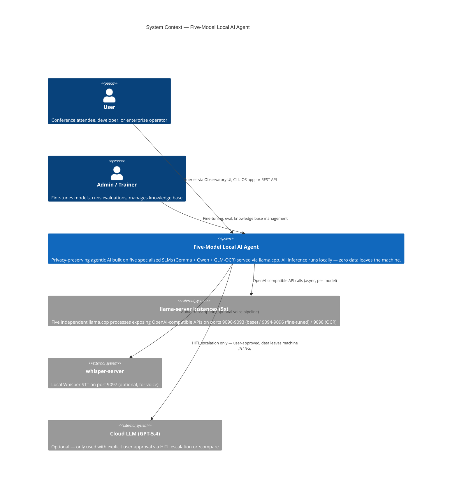
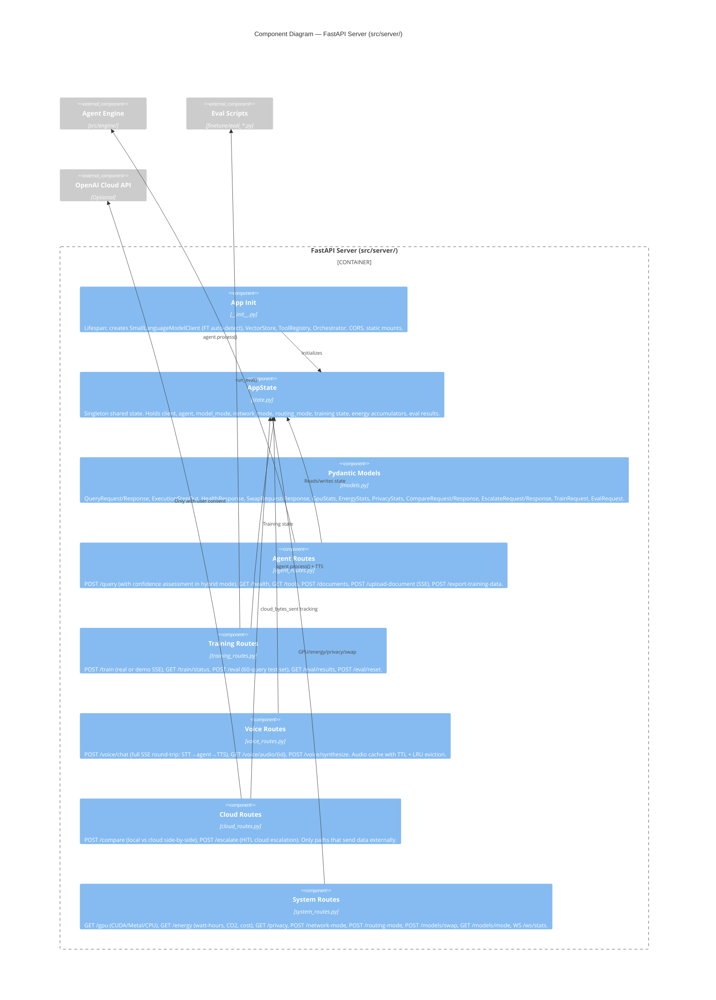
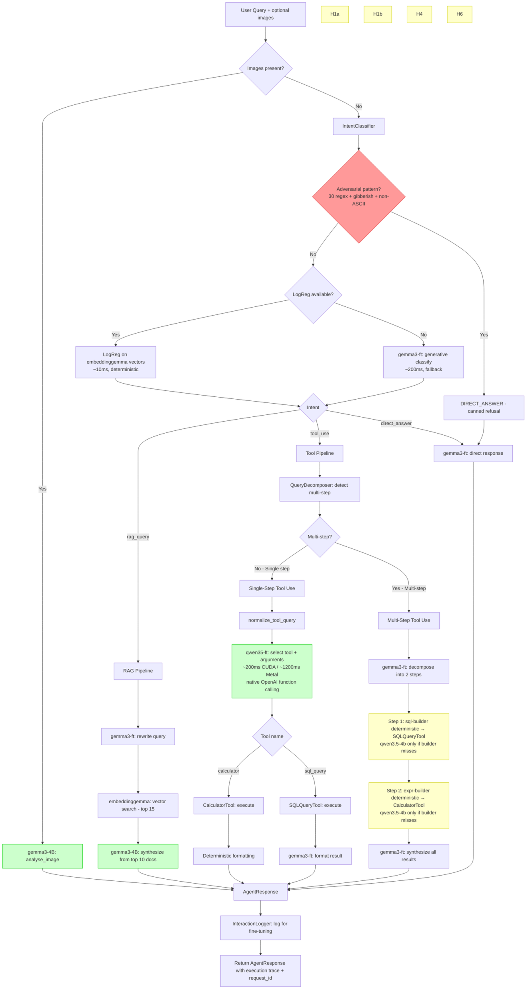
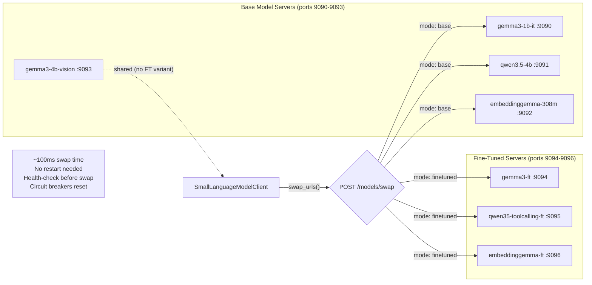
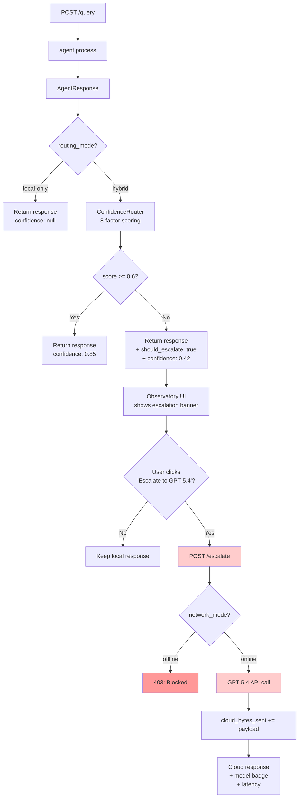

# C4 Architecture Diagrams — Five-Model Local AI Agent

> Generated from full codebase review (2026-03-09). Updated 2026-04-05 for multi-scenario support.
> Uses [C4 model](https://c4model.com/) notation rendered as Mermaid diagrams.
>
> **Multi-scenario**: The system supports multiple domain scenarios via `scenarios/<name>.json`. All data, prompts, SQL schemas, and model GGUFs are scenario-specific. Switching: `--scenario nextera` (default; the Nextera SaaS scenario is the only one shipped in this repo — add more as `scenarios/<name>.json`).

---

## Level 1: System Context Diagram

Shows the system as a whole, its users, and external dependencies.



---

## Level 2: Container Diagram

Shows the major containers (applications, data stores, services) within the system.

```mermaid
C4Container
    title Container Diagram — Five-Model Local AI Agent

    Person(user, "User")

    Container_Boundary(system, "Local AI Agent System") {

        Container(fastapi, "FastAPI Server", "Python / uvicorn", "REST API + static file server. Routes: /query, /health, /tools, /compare, /escalate, /train, /eval, /voice/*, /gpu, /privacy, /models/swap. Port 8000.")

        Container(observatory_react, "Observatory React", "React 19 + Vite + TypeScript", "Full-featured SPA at /app. Three-path comparison (multi-models/Qwen/cloud), live document drop, hybrid routing, eval A/B dashboard, energy tracking, voice.")

        Container(cli_demo, "CLI Demo", "Python / Rich", "demo.py — Rich console showcase with 7 text + 3 image queries, interactive REPL mode.")

        Container(ios_app, "LocalLife iOS", "SwiftUI / LEAP SDK", "On-device agent using LFM 2.5 1.2B via Neural Engine. HealthKit, Calendar, Reminders tools.")

        Container(engine, "Agent Engine", "Python", "Core agent runtime: orchestrator, intent classifier, query decomposer, tool framework, scaffolding, inference client, knowledge pipeline.")

        ContainerDb(chromadb, "ChromaDB", "Persistent vector store", "Two collections: knowledge_base (scenario-specific curated docs) + uploads (user-uploaded documents via OCR/pypdf). Cosine similarity, external embeddings via embeddinggemma. Path: scenarios/*.json → paths.chroma_dir.")

        ContainerDb(sqlite, "SQLite", "Scenario DB", "Scenario-specific tables and schema. Nextera reference scenario: products/customers/sales/competitors. Per-scenario tables are configured via scenarios/*.json → paths.db.")

        ContainerDb(jsonl_logs, "Interaction Logs", "JSONL / JSON", "Thread-safe interaction logging for fine-tuning data collection and export.")
    }

    Container_Boundary(model_servers, "Model Servers (llama.cpp)") {
        Container(gemma3_1b, "gemma3-ft (1B)", "llama-server", "Direct answers, query decomposition, tool-result synthesis, and intent-classification fallback when LogReg model is unavailable. Primary intent path is LogReg on embeddings — see Component diagram. Port 9090 (base) / 9094 (FT).")
        Container(qwen3.5-4b, "qwen35-toolcalling-ft v8 (4B)", "llama-server", "Tool selection + argument generation for calculator and sql_query. Native function calling. Port 9091 (base ref) / 9095 (FT). 99.4% routing accuracy.")
        Container(embeddinggemma, "embeddinggemma (308M)", "llama-server", "768-dim semantic embeddings for RAG retrieval. Port 9092 / 9096.")
        Container(gemma3_4b, "gemma3-4B (Vision + Synthesis)", "llama-server", "Multimodal image analysis + RAG synthesis. Port 9093. Fine-tuned on extractive QA per scenario (Gemma3ForConditionalGeneration + LoRA, vision frozen).")
    }

    Container_Ext(glm_ocr, "GLM-OCR (0.9B)", "llama-server", "PDF text + table extraction via vision model. Port 9098. Upload-time only. Optional.")
    Container_Ext(whisper, "whisper-server", "whisper.cpp", "Speech-to-text (Metal/CUDA). Port 9097. Optional.")
    Container_Ext(piper, "Piper TTS", "ONNX / CPU", "Text-to-speech (EN/DE voices). In-process. Optional.")

    Rel(user, observatory_spa, "Browser")
    Rel(user, observatory_react, "Browser")
    Rel(user, cli_demo, "Terminal")
    Rel(user, ios_app, "iPhone")
    Rel(observatory_spa, fastapi, "HTTP/SSE/WebSocket")
    Rel(observatory_react, fastapi, "HTTP/SSE/WebSocket")
    Rel(cli_demo, engine, "Direct Python import")
    Rel(fastapi, engine, "Python import")
    Rel(engine, gemma3_1b, "OpenAI API (async)")
    Rel(engine, qwen3.5-4b, "OpenAI API (async)")
    Rel(engine, embeddinggemma, "OpenAI API (async)")
    Rel(engine, gemma3_4b, "OpenAI API (async)")
    Rel(engine, chromadb, "Embed + query")
    Rel(engine, sqlite, "Read-only SELECT")
    Rel(engine, jsonl_logs, "Write interactions")
    Rel(fastapi, whisper, "Transcription (optional)")
    Rel(fastapi, piper, "TTS synthesis (optional)")
```

---

## Level 3: Component Diagram — Agent Engine

The core runtime: how user queries flow through the orchestrator, models, scaffolding, and tools.

```mermaid
C4Component
    title Component Diagram — Agent Engine (src/engine/)

    Container_Boundary(agent_layer, "Agent Layer (src/engine/agent/)") {
        Component(orchestrator, "SmallLanguageModelAgentOrchestrator", "orchestrator.py (~218 lines)", "Thin router: validate → classify → dispatch to handler → log. Delegates to DirectAnswerHandler, RAGHandler, ToolUseHandler, VisionHandler.")
        Component(intent_classifier, "IntentClassifier", "intent_classifier.py + intent_classifier_logreg.py", "Primary: LogReg on embeddinggemma vectors (~10ms, deterministic, 96.1%). Fallback: generative gemma3-ft (~200ms). Pre-filter: 30-regex injection + gibberish + non-ASCII detectors.")
        Component(query_decomposer, "QueryDecomposer", "query_decomposer.py", "Detects multi-step queries (11 regex patterns). Decomposes via gemma3 + fallback split.")
        Component(tool_arg_resolver, "ToolArgumentResolver", "tool_argument_resolver.py", "Protocol-based DI for expression/SQL resolvers. Static helpers: normalize, rephrase, patch.")
        Component(interaction_logger, "InteractionLogger", "interaction_logger.py", "Thread-safe JSONL logging. Captures query, intent, response, steps, tokens for fine-tuning export.")
        Component(types, "Types & Constants", "types.py", "Intent enum (4-way), ExecutionStep, AgentResponse, CLASSIFY_PROMPT. Single source of truth.")
    }

    Container_Boundary(inference_layer, "Inference Layer (src/engine/inference/)") {
        Component(gemma_client, "SmallLanguageModelClient", "client.py", "Unified async client for all 4 models. Per-model circuit breakers, semaphore concurrency limits, dual-port swap, FT auto-detection.")
        Component(config, "Config", "config.py", "Centralized constants: timeouts, temperatures, max_tokens, tool limits, voice settings, cloud pricing. Env-overridable.")
    }

    Container_Boundary(scaffolding_layer, "Scaffolding Layer (src/engine/scaffolding/)") {
        Component(confidence_router, "ConfidenceRouter", "confidence_router.py", "8-factor heuristic confidence scoring. Decides cloud escalation in hybrid routing mode.")
    }
    ' Note: deterministic ExpressionBuilder / SQLBuilder pre-routers were retired once Qwen3.5-4B FT v8 took over native tool-argument generation. NullExpressionResolver / NullSQLResolver in src/engine/agent/tool_argument_resolver.py replace them in production.

    Container_Boundary(knowledge_layer, "Knowledge Layer (src/engine/knowledge/)") {
        Component(vector_store, "VectorStore", "vector_store.py", "ChromaDB wrapper. External embeddings via embeddinggemma. Cosine similarity. Async add/search/count.")
        Component(doc_processor, "DocumentProcessor", "document_processor.py", "PDF/TXT/MD parsing, semantic chunking via chonkie (paragraph-boundary + embedding similarity), fixed-size fallback (800 chars, 80 overlap), SSE progress events.")
    }

    Container_Boundary(tools_layer, "Tools Layer (src/engine/tools/)") {
        Component(tool_registry, "ToolRegistry", "tool_registry.py", "Central store. Registration order matters (positional bias). Safe execution with logging. Schema generation for Qwen3.5-4B FT.")
        Component(calculator, "CalculatorTool", "calculator.py", "Sandboxed math eval via simpleeval. Expression normalization (%, ^, trailing =). Whitelisted functions only.")
        Component(sql_query, "SQLQueryTool", "sql_query.py", "Read-only SELECT against SQLite. Outer-paren stripping, LIMIT enforcement, row_factory.")
        Component(vector_search, "VectorSearchTool", "vector_search.py", "Semantic document retrieval. Wraps VectorStore.search().")
    }

    Rel(orchestrator, intent_classifier, "Classifies intent")
    Rel(orchestrator, query_decomposer, "Detects/decomposes multi-step")
    Rel(orchestrator, tool_arg_resolver, "Normalizes, resolves expressions/SQL")
    Rel(orchestrator, interaction_logger, "Logs every interaction")
    Rel(orchestrator, gemma_client, "All LLM calls")
    Rel(orchestrator, tool_registry, "Executes tools")
    Rel(intent_classifier, gemma_client, "LogReg primary (embeddinggemma),\ngemma3-ft fallback")
    Rel(query_decomposer, gemma_client, "gemma3-ft decomposition; concretization via Qwen FT (FUNCTION role, since 3db64e4)")
    ' tool_arg_resolver previously dispatched to ExpressionBuilder / SQLBuilder
    ' for deterministic overrides; in production it uses Null*Resolver no-ops
    ' (Qwen3.5-4B FT v8 generates tool arguments natively).
    Rel(tool_registry, calculator, "Delegates")
    Rel(tool_registry, sql_query, "Delegates")
    Rel(tool_registry, vector_search, "Delegates")
    Rel(vector_search, vector_store, "Semantic search")
    Rel(doc_processor, vector_store, "Indexes chunks")
    Rel(gemma_client, config, "Reads all parameters")
```

---

## Level 3: Component Diagram — FastAPI Server

The HTTP layer that exposes the agent engine to clients.



---

## Level 4: Code Diagram — Query Processing Flow

Detailed flow for a single user query through the orchestrator.



Legend: Green = AI inference, Yellow = Deterministic scaffolding (pre-router), Red = Security filter

---

## Level 4: Code Diagram — Dual-Port Model Swap Architecture



---

## Level 4: Code Diagram — Fine-Tuning Data Flywheel

```mermaid
flowchart TD
    subgraph "Runtime (Use)"
        Q[User Query] --> O[Orchestrator]
        O --> R[AgentResponse]
        O --> IL[InteractionLogger]
        IL --> JSONL[(Interaction Logs)]
    end

    subgraph "Training Pipeline (Train)"
        JSONL --> DP[data_prep*.py]
        DP --> TD[(Training Datasets)]
        TD --> TG[train_gemma3.py<br/>LoRA, 7 epochs]
        TD --> TF[train_qwen35_toolcalling.py<br/>LoRA r=16, 3 epochs]
        TD --> TE[train_embeddinggemma.py<br/>Contrastive, 10 epochs]
        TG --> GGUF1[convert_gemma3_to_gguf.sh]
        TF --> GGUF2[convert_qwen35_to_gguf.sh]
        TE --> GGUF3[convert_embeddinggemma_to_gguf.sh]
    end

    subgraph "Evaluation (Measure)"
        GGUF1 --> EG[eval_gemma3.py<br/>180 queries, 96.7%]
        GGUF2 --> EF[eval_tool_routing.py<br/>160 queries, 99.4%]
        GGUF3 --> EE[eval_embeddinggemma.py<br/>MRR@10 0.98]
        EG --> EA[eval_adversarial.py<br/>60 queries, 93.3% (pipeline)]
        EG --> EM[eval_multi_step.py<br/>80 queries, 97.5% chain]
        EG --> EV[eval_vision.py<br/>10 queries, 100%]
        EG --> EP[eval_expression_pipeline.py<br/>80 queries, 95.0%]
    end

    subgraph "Deployment (Deploy)"
        GGUF1 --> SS[start_servers.sh --ft-extra]
        GGUF2 --> SS
        GGUF3 --> SS
        SS --> SWAP[POST /models/swap<br/>mode: finetuned]
        SWAP --> O
    end
```

---

## Level 4: Code Diagram — Hybrid Routing & HITL Escalation



---

## Cross-Cutting Concerns

### Resilience Patterns

| Pattern | Implementation | Scope |
|---------|---------------|-------|
| **Circuit Breaker** | `CircuitBreaker` class in `client.py` — 3 failures → open, 30s recovery, half-open probe | Per-model (4 breakers) |
| **Concurrency Limit** | `asyncio.Semaphore(4)` per model role | Prevents saturating llama-server |
| **Pipeline Timeout** | `PIPELINE_TIMEOUT=60s` + per-step deadline checks | Multi-step queries reserve time for synthesis |
| **Graceful Degradation** | Vision model optional, whisper optional, cloud optional | Features degrade independently |
| **Deterministic Inference** | `temperature=0, seed=42, top_k=1, top_p=1, --parallel 1` | Reproducible outputs for classification and routing |

### Security Boundaries

| Boundary | Mechanism |
|----------|-----------|
| SQL injection | Read-only SELECT enforcement at the executor (`src/engine/tools/sql_query.py`): regex pre-filter blocks INSERT/UPDATE/DELETE/DROP/CREATE/ALTER/etc. before the query reaches SQLite. |
| Code execution | `simpleeval` sandbox — no builtins, no imports, whitelisted functions only |
| Prompt injection | Multi-layer defense: 30-regex pre-filter + gibberish detector + non-ASCII filter + LogReg confidence threshold (0.60) + canned refusal. 93.3% adversarial robustness. |
| Cloud data leakage | Network mode toggle (kills /compare + /escalate), explicit HITL consent required |
| Query length | 2000-char hard limit in orchestrator |
| Remote access | ngrok OAuth policy — unauthenticated requests never reach the machine |

### Observability

| Signal | Implementation |
|--------|---------------|
| **Request tracing** | 12-char hex `request_id` per AgentResponse |
| **Execution trace** | `ExecutionStep` list with action, model, duration_ms, tokens, details |
| **Latency waterfall** | Per-step timing on shared time axis in Observatory UI |
| **Token accounting** | Prompt + completion tokens tracked per step and aggregated |
| **GPU monitoring** | Real-time VRAM, utilization, temperature, power (CUDA/Metal) via `/gpu` + WebSocket push |
| **Energy tracking** | Trapezoidal integration of GPU power over time, CO2 estimates, cloud comparison |
| **Privacy proof** | `/privacy` endpoint: queries, tokens, external_bytes_sent, network_mode |
| **Cost counter** | `Local: $0.00 | Cloud (est.): $X.XX` based on GPT-5.4 pricing ($2.50/1M input, $15.00/1M output) |
